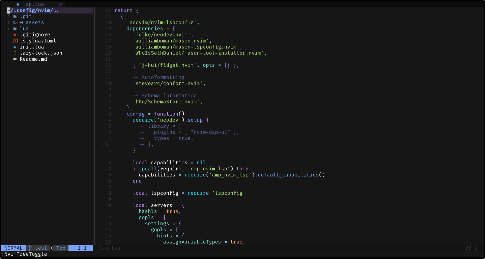
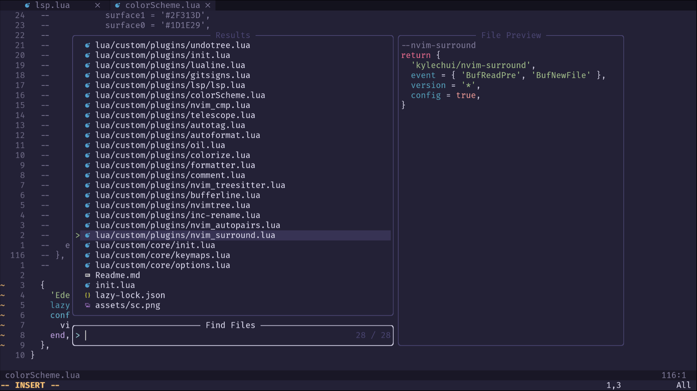
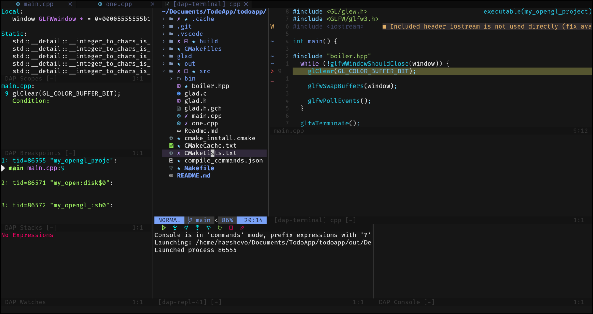

# Nvim-evo

A personal Neovim config powered by [lazy.nvim](https://github.com/folke/lazy.nvim). It includes LSP, completion, formatting, Telescope, nvim-tree, Treesitter, C/C++ helpers, a small build/run workflow, and a few quality-of-life keymaps.

<details closed>
<summary>Screenshots</summary>





</details>

## Requirements

Use Neovim `0.11+`. This config uses the newer `vim.lsp.config` / `vim.lsp.enable` APIs.

Core tools:

- `git`: required by lazy.nvim and plugins.
- `make`: builds `telescope-fzf-native.nvim`.
- `ripgrep` (`rg`): required for Telescope live grep.
- `fd`: improves Telescope file finding.
- A Nerd Font: required for icons from `nvim-web-devicons`.
- `trash`: required by nvim-tree safe delete. On some systems this comes from `trash-cli`, but the executable must be named `trash`.

Useful language/build tools:

- C/C++: `clang`, `clang++`, `gcc`, `g++`, `clangd`, `cmake`, `ctest`, `lldb`.
- JavaScript/TypeScript: `node`, `npm`, `npx`.
- Python: `python3`.
- Go: `go`.
- Assembly runner: `nasm` and `ld`.
- tmux navigation: `tmux`, only needed if you use the tmux keymaps.
- OCaml LSP: `opam` and `ocaml-lsp-server`, only needed if you use OCaml.
- Docker LSP: Docker tooling, only needed if you edit Dockerfiles often.

Mason installs most Neovim language tools automatically on first start, including:

- LSPs: `bashls`, `lua_ls`, `jsonls`, `yamlls`, `clangd`, `vtsls`, `pyright`, `dockerls`, `tailwindcss-language-server`.
- Formatters/debug tools: `stylua`, `prettier`, `goimports`, `isort`, `black`, `clang-format`, `delve`.

If Mason misses anything, open Neovim and run:

```vim
:Mason
:MasonToolsInstall
```

## Install System Dependencies

### macOS

```sh
brew install neovim git ripgrep fd make cmake llvm node python go trash tmux nasm
```

Notes:

- Apple already ships `clang`, `clang++`, `lldb`, and `/usr/bin/make`, but installing `llvm` gives newer LLVM tools.
- If `clangd` or `clang-format` from Homebrew LLVM are not on your `PATH`, Mason can still install them for Neovim.
- nvim-tree calls a command named `trash`. Check it with `command -v trash`.

### Ubuntu/Debian

```sh
sudo apt update
sudo apt install -y git ripgrep fd-find make build-essential clang clangd clang-format cmake python3 python3-pip nodejs npm golang-go trash-cli tmux nasm lldb
```

On Debian/Ubuntu, `fd` is often installed as `fdfind`. Telescope can still work, but if you want the `fd` command name:

```sh
mkdir -p ~/.local/bin
ln -sf "$(command -v fdfind)" ~/.local/bin/fd
```

For nvim-tree trash support, the config expects a command named `trash`. If your `trash-cli` package only gives `trash-put`, add a small wrapper:

```sh
mkdir -p ~/.local/bin
printf '#!/bin/sh\nexec trash-put "$@"\n' > ~/.local/bin/trash
chmod +x ~/.local/bin/trash
```

Make sure `~/.local/bin` is on your `PATH`.

### Windows

Install Neovim, Git, a C compiler toolchain, Node.js, Python, and ripgrep/fd. With winget:

```powershell
winget install Neovim.Neovim Git.Git BurntSushi.ripgrep sharkdp.fd OpenJS.NodeJS Python.Python.3.12
```

For C/C++, install LLVM or Visual Studio Build Tools. For nvim-tree trash support on Windows, install a CLI that provides a `trash` command or change `trash.cmd` in `lua/custom/plugins/nvimtree.lua`.

## Install This Config

Linux/macOS:

```sh
git clone https://github.com/harshevo/Nvim-evo.git ~/.config/nvim
nvim
```

Windows CMD:

```cmd
git clone https://github.com/harshevo/Nvim-evo.git %USERPROFILE%\AppData\Local\nvim
nvim
```

Windows PowerShell:

```powershell
git clone https://github.com/harshevo/Nvim-evo.git $ENV:USERPROFILE\AppData\Local\nvim
nvim
```

If those Windows paths do not work, use:

- CMD: `%LOCALAPPDATA%\nvim`
- PowerShell: `$ENV:LocalAppData\nvim`

## First Start

1. Open `nvim`.
2. lazy.nvim bootstraps itself and installs plugins.
3. Run `:Lazy sync` if a plugin did not install cleanly.
4. Run `:Mason` or `:MasonToolsInstall` to confirm LSPs and formatters are installed.
5. Run `:checkhealth` to catch missing system tools.

## Important Paths

- Main entry: `init.lua`
- Plugins: `lua/custom/plugins/`
- LSP setup: `lua/custom/plugins/lsp/lsp.lua`
- Keymaps: `lua/custom/core/keymaps.lua`
- Options: `lua/custom/core/options.lua`
- Colorscheme: `lua/custom/plugins/colorScheme.lua`
- Build/run helper: `lua/runner.lua`
- Help search directory: configured in `init.lua` as `~/dev/help`

## Keymaps

Leader is `<Space>`.

- `<leader>e`: toggle nvim-tree.
- In nvim-tree, `d`: move file to trash.
- In nvim-tree, `D`: permanently delete.
- In nvim-tree, `<C-z>`: restore last trashed file.
- `<leader>ff`: Telescope find files.
- `<leader>fg`: Telescope live grep.
- `<leader>sG`: live grep from the git root.
- `<leader>fd`: Telescope diagnostics.
- `<leader>mp`: format current file or visual selection.
- `<leader>b`: build/check current project into quickfix.
- `<leader>r`: run built target or project command.
- `<F5>`: run the current file.
- `<leader>co`: open quickfix.
- `<leader>cn` / `<leader>cp`: next/previous quickfix item.
- `<S-l>` / `<S-h>`: next/previous buffer.

CMake keymaps:

- `<leader>mg`: generate.
- `<leader>mb`: build.
- `<leader>mr`: run.
- `<leader>md`: debug.
- `<leader>mt`: select build type.
- `<leader>mst`: select build target.
- `<leader>ml`: select launch target.
- `<leader>mc`: clean.
- `<leader>ms`: stop runner/executor.

## Build And Run Support

The custom runner supports:

- Python files with `python3`.
- C/C++ single files with `gcc`, `g++`, `clang`, or `clang++`.
- CMake projects with `cmake`.
- Make projects with `make`.
- Go projects with `go test` / `go run`.
- JS/TS projects with `npm`, `node`, `npx tsc`, and `npx tsx`.
- Assembly files with `nasm` and `ld`.

Project run commands can be saved in `.nvim-run.json`.

## Notes

- `nvim-tree` itself is a Neovim plugin, not a CLI. The external CLI it needs here is `trash`.
- Python and Node providers are disabled in `init.lua` because this config does not currently need provider-based plugins.
- DAP and DBUI keymaps exist in `lua/custom/core/keymaps.lua`, but the matching plugins are not currently included in this repo. Add `nvim-dap` / `vim-dadbod-ui` before relying on those keymaps.
- C/C++ debug config references `codelldb`; install the VS Code LLDB extension or adjust `lua/custom/utils/codelldb.lua` if you wire DAP back in.
