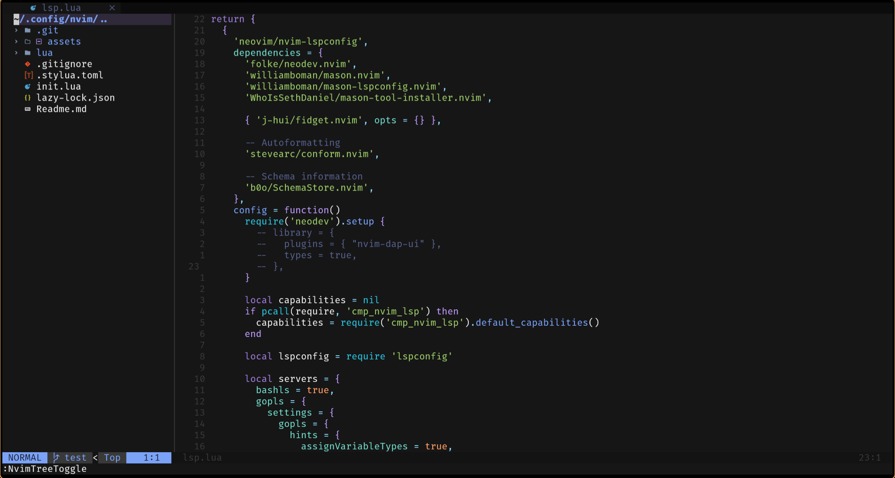
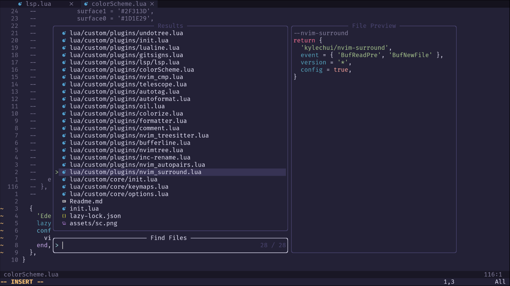
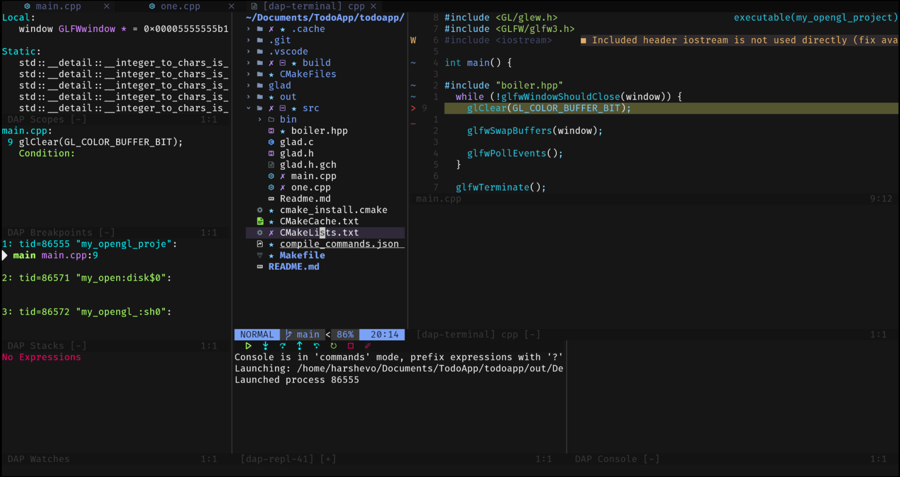

# Nvim-evo

A personal Neovim config powered by [lazy.nvim](https://github.com/folke/lazy.nvim). It includes LSP, completion, formatting, Telescope, nvim-tree, Treesitter, C/C++ helpers, a small build/run workflow, and a few quality-of-life keymaps.

<details closed>
<summary>Screenshots</summary>





</details>

## Requirements

Use Neovim `0.11+`. This config uses the newer `vim.lsp.config` / `vim.lsp.enable` APIs.

Core tools:

- `git`: required by lazy.nvim and plugins.
- `make`: builds `telescope-fzf-native.nvim`.
- `ripgrep` (`rg`): required for Telescope live grep.
- `fd`: improves Telescope file finding.
- A Nerd Font: required for icons from `nvim-web-devicons`.
- `trash`: required by nvim-tree safe delete. On some systems this comes from `trash-cli`, but the executable must be named `trash`.

Useful language/build tools:

- C/C++: `clang`, `clang++`, `gcc`, `g++`, `clangd`, `cmake`, `ctest`, `lldb`.
- JavaScript/TypeScript: `node`, `npm`, `npx`.
- Python: `python3`, `uv`, project `pytest`; editor Ruff/debugpy use an isolated environment.
- Go: `go`.
- Assembly runner: `nasm` and `ld`.
- tmux navigation: `tmux`, only needed if you use the tmux keymaps.
- OCaml LSP: `opam` and `ocaml-lsp-server`, only needed if you use OCaml.
- Docker LSP: Docker tooling, only needed if you edit Dockerfiles often.

Run `:MasonToolsInstall` to install the configured language tools. Installation checks are disabled during startup so opening a file stays fast. Configured tools include:

- LSPs: `bashls`, `lua_ls`, `jsonls`, `yamlls`, `clangd`, `vtsls`, `pyright`, `dockerls`, `tailwindcss-language-server`.
- Formatters/debug tools: `stylua`, `prettier`, `goimports`, `clang-format`, `delve`.

If Mason misses anything, open Neovim and run:

```vim
:Mason
:MasonToolsInstall
```

## Install System Dependencies

### macOS

```sh
brew install neovim git ripgrep fd make cmake ninja ccache llvm node python uv go trash tmux nasm
```

Notes:

- Apple already ships `clang`, `clang++`, `lldb`, and `/usr/bin/make`, but installing `llvm` gives newer LLVM tools.
- If `clangd` or `clang-format` from Homebrew LLVM are not on your `PATH`, Mason can still install them for Neovim.
- nvim-tree calls a command named `trash`. Check it with `command -v trash`.

### Ubuntu/Debian

```sh
sudo apt update
sudo apt install -y git ripgrep fd-find make build-essential clang clangd clang-format cmake python3 python3-pip nodejs npm golang-go trash-cli tmux nasm lldb
```

On Debian/Ubuntu, `fd` is often installed as `fdfind`. Telescope can still work, but if you want the `fd` command name:

```sh
mkdir -p ~/.local/bin
ln -sf "$(command -v fdfind)" ~/.local/bin/fd
```

For nvim-tree trash support, the config expects a command named `trash`. If your `trash-cli` package only gives `trash-put`, add a small wrapper:

```sh
mkdir -p ~/.local/bin
printf '#!/bin/sh\nexec trash-put "$@"\n' > ~/.local/bin/trash
chmod +x ~/.local/bin/trash
```

Make sure `~/.local/bin` is on your `PATH`.

### Windows

Install Neovim, Git, a C compiler toolchain, Node.js, Python, and ripgrep/fd. With winget:

```powershell
winget install Neovim.Neovim Git.Git BurntSushi.ripgrep sharkdp.fd OpenJS.NodeJS Python.Python.3.12
```

For C/C++, install LLVM or Visual Studio Build Tools. For nvim-tree trash support on Windows, install a CLI that provides a `trash` command or change `trash.cmd` in `lua/custom/plugins/nvimtree.lua`.

## Install This Config

Linux/macOS:

```sh
git clone https://github.com/harshevo/Nvim-evo.git ~/.config/nvim
nvim
```

Windows CMD:

```cmd
git clone https://github.com/harshevo/Nvim-evo.git %USERPROFILE%\AppData\Local\nvim
nvim
```

Windows PowerShell:

```powershell
git clone https://github.com/harshevo/Nvim-evo.git $ENV:USERPROFILE\AppData\Local\nvim
nvim
```

If those Windows paths do not work, use:

- CMD: `%LOCALAPPDATA%\nvim`
- PowerShell: `$ENV:LocalAppData\nvim`

## First Start

1. Open `nvim`.
2. lazy.nvim bootstraps itself and installs plugins.
3. Run `:Lazy sync` if a plugin did not install cleanly.
4. Run `:MasonToolsInstall` to install LSPs and formatters.
5. Run `:TSInstall c cpp go lua python rust tsx javascript typescript vimdoc vim bash` for syntax parsers.
6. Run `:checkhealth` to catch missing system tools.

## Important Paths

- Main entry: `init.lua`
- Plugins: `lua/custom/plugins/`
- LSP setup: `lua/custom/plugins/lsp/lsp.lua`
- Keymaps: `lua/custom/core/keymaps.lua`
- Options: `lua/custom/core/options.lua`
- Colorscheme: `lua/custom/plugins/colorScheme.lua`
- Build/run helper: `lua/runner.lua`
- Help search directory: configured in `init.lua` as `~/dev/help`

## Keymaps

Leader is `<Space>`.

- `<leader>e`: toggle nvim-tree.
- In nvim-tree, `d`: move file to trash.
- In nvim-tree, `D`: permanently delete.
- In nvim-tree, `<C-z>`: restore last trashed file.
- `<leader>ff`: Telescope find files.
- `<leader>fg`: Telescope live grep.
- `<leader>sG`: live grep from the git root.
- `<leader>fd`: Telescope diagnostics.
- `<leader>mp`: format current file or visual selection.
- `<leader>b`: instantly toggle the error split; save/check in the background.
- `<leader>B`: full project build; Enter jumps to an error, q closes the split.
- `<leader>r`: save modified buffers, rebuild, then run the project.
- `<Space>R`: save, compile and run the current file.
- `<leader>co`: open quickfix.
- `<leader>cn` / `<leader>cp`: next/previous quickfix item.
- `<S-l>` / `<S-h>`: next/previous buffer.

CMake keymaps:

- `<leader>mg`: generate.
- `<leader>mb`: build.
- `<leader>mr`: save, rebuild and run.
- `<leader>md`: debug.
- `<leader>mt`: select build type.
- `<leader>mst`: select build target.
- `<leader>ml`: select launch target.
- `<leader>mc`: clean.
- `<leader>ms`: stop runner/executor.

## Build And Run Support

The custom runner supports:

- Python files with the selected project interpreter and fresh project imports.
- C/C++ single files with `gcc`, `g++`, `clang`, or `clang++`.
- CMake projects with `cmake`.
- Make projects with `make`.
- Go projects with `go test` / `go run`.
- JS/TS projects with `npm`, `node`, `npx tsc`, and a locally installed `tsx` (no automatic package downloads when running).
- Linux ELF32 assembly files with `nasm` and `ld`. On macOS, use a project Makefile with the appropriate assembler/linker.

`Space R` runs the current file; `<Space>r` rebuilds and runs the project. Builds and runs save all named modified source buffers, including edited headers. A failed save or build aborts the run. Single-file C/C++ uses C17/C++20 with `-O0 -g` for quick builds and debugging; project builds retain their own compiler flags.

Each source path has its own executable under Neovim's cache directory. Each run replaces the previous terminal job and output, so waiting programs cannot consume the next run command. `Esc` leaves terminal input mode; `H` (or `K`) in terminal normal mode closes output. Capital `H` remains available as program input. `:RunStop` stops the active runner build and closes output. `:RunNow arg1 "arg with spaces"` passes optional shell arguments without an input prompt. File runs use the source directory; project runs use the detected project root.

Make-based builds track editor saves so changes within the same second still trigger rebuilding and relinking affected targets. CMake projects build incrementally and read CMake's file API to find executable targets. A single executable launches automatically; multiple executables prompt for a selection, remembered for the session. Set `cmake_target` in `.nvim-run.json` for a persistent target choice. Make projects need a `run` target or a custom command.

Project commands can be saved in `.nvim-run.json`:

```json
{
  "cmake_target": "app",
  "run": {
    "cpp": "./build/app",
    "python": "python3 -m my_package",
    "javascript": "npm run dev"
  }
}
```

There is one format-on-save handler, with a 500 ms budget. Use `:KickstartFormatToggle` to toggle it or `<Space>mp` to format manually. Files at least 1 MiB or 20,000 lines skip Treesitter, LSP, completion and automatic formatting. Treesitter highlighting starts after the first screen draw. JSON/YAML schemas and formatting tools load when used.

Runner regression checks:

```sh
nvim --headless -u NONE -l tests/runner.lua
nvim --headless '+lua dofile("tests/runner.lua")'
nvim --headless '+lua dofile("tests/cmake.lua")'
```

## C/C++ Development

`:CppHelp` opens the complete local shortcut guide. Saving C/C++ applies Allman braces (including empty functions, control flow and classes), using `clang-format.yaml` in this configuration, with two-space indentation. This style overrides project `.clang-format` files. `<Space>cf` formats asynchronously.

- `K`: function signature and header documentation; `gK` / insert `Ctrl-k`: call signature help.
- `gd`, `gD`, `gr`, `gi`, `gT`: definition, declaration, references, implementation and type.
- `<Space>cr`, `<Space>ca`: rename and code actions; `<Space>ch`: source/header switch.
- `<Space>cs`: file symbols; `<Space>ci`: parameter/type hints.
- `<Space>cm`: installed C/POSIX manual; `<Space>fm`: cached asynchronous manual search.
- `<Space>cR`: online cppreference search. Third-party docs depend on installed headers/manuals.
- `Space dc`: build/debug or continue; `Space db`: breakpoint; `Space do`/`Space di`/`Space dO`: step over/into/out.
- `<Space>ds`, `<Space>df`, `<Space>dr`, `<Space>dq`: debug variables, stack, REPL and stop.
- `<Space>x`: close buffer (the `<Space>c` prefix is reserved for C/C++ commands).

Standalone checks avoid linking, and clangd uses C17/C++20 for standalone files. Project flags come from the compilation database or project configuration. Common CMake database locations are detected; use `:CppRestart` after creating or switching build directories. New CMake builds default to Debug; existing build types are preserved.

Additional integration checks (run from this directory):

```sh
nvim --headless '+lua dofile("tests/cpp.lua")'
nvim --headless '+lua dofile("tests/debug.lua")'
```

## IDE Commands

Pause after `Space` for the shortcut menu. `Space pp` opens the C/C++ command palette and `Space fk` searches all mappings. `:CppHelp` documents the full workflow.

| Keys | Action |
| --- | --- |
| `Space mP` / `Space mt` | Choose, configure and activate CMake preset |
| `Space mg` / `Space ml` | Configure active preset / select executable target |
| `Space mI` / `Space mC` | Create local presets / compiler cache statistics |
| `Space tt` / `Space ts` | Build and run all CTest tests / select test |
| `Space tl` / `Space tf` | Rerun last selection / failed tests |
| `Space to` / `Space tq` | Toggle test output / stop tests |
| `Space cl` | Background clang-tidy analysis |
| `Space ao` / `Space aq` / `Space as` | Analysis output / quickfix / stop |
| `Space du` / `Space de` | Debugger panels / evaluate expression |
| `Space cw` / `Space cI` / `Space cO` | Project symbols / callers / callees |
| `Space ps` / `Space pl` | Save / restore project session and preset |

New CMake builds prefer Ninja and use ccache compiler launchers. Standalone C/C++ compiles a cached object and performs a fresh link. Existing generators are preserved. Local Debug/Release/ASan/UBSan presets are created in `CMakeUserPresets.json` when requested; keep that file out of version control. Preset selection persists per project and supplies build/run/test/debug commands and clangd with the same build directory.

Tests use CTest registrations (`include(CTest)`, `add_test`, or framework discovery). Builds complete before tests start; failures and analysis findings support source jumps. Analysis respects `.clang-tidy` and project compiler flags. Sessions live under Neovim's state directory. Creating local presets appends generated-directory indexing exclusions to `.clangd` without replacing project settings.

Extra integration checks:

```sh
nvim --headless '+lua dofile("tests/ide.lua")'
nvim --headless '+lua dofile("tests/analysis.lua")'
CPP_TEST_CMAKE=1 nvim --headless '+lua dofile("tests/debug.lua")'
```

## Notes

- `nvim-tree` itself is a Neovim plugin, not a CLI. The external CLI it needs here is `trash`.
- Python and Node providers are disabled in `init.lua` because this config does not currently need provider-based plugins.
- nvim-dap and debugger panels load on demand. C/C++ uses LLDB; Python uses debugpy. DBUI shortcuts require a separate `vim-dadbod-ui` installation.

## Python Development

`:PyHelp` opens the complete Python guide. Python buffers, run terminals and task panes use the same command/test/analysis/session shortcuts as C/C++, with Python-specific actions. `Space pp` opens the searchable Python command palette.

| Keys | Action |
| --- | --- |
| `Space pe` / `Space pE` | Select / inspect Python environment |
| `Space pv` / `Space pS` | Create .venv / synchronize uv dependencies |
| `Space R` / `Space r` | Save and run file / project command |
| `Space b` / `Space B` | Toggle file errors / check whole project |
| `K` / `gK` | Signature, types and docstring / call signature |
| `Space cf` / `Space ca` | Format / code action |
| `Space tt` / `Space tF` / `Space tn` | All / file / nearest pytest tests |
| `Space ts` / `Space tl` / `Space tf` | Select / last / failed tests |
| `Space to` / `Space tq` | Toggle test output / stop tests |
| `Space cl` / `Space cT` | Project Ruff analysis / type checking |
| `Space dc` / `Space du` | Debug or continue / toggle debugger panels |
| `Space cm` / `Space cR` | Offline API docs / official online docs |
| `Space pr` / `Space ps` / `Space pl` | REPL / save / restore session |

Python formatting uses Ruff import sorting and formatting, retaining project configuration. Pyright supplies completion, navigation, signatures, auto-import suggestions and standard type checking. Automatic type analysis covers open files; workspace checks run on demand. Four-space indentation and large-file safeguards apply.

Interpreter selection persists per project. Detection prefers project `.venv`/`venv`/`env`, then active virtualenv/Conda, then PATH. Select any Poetry/Conda/custom interpreter with `:PyEnv /path/to/python`. Runs, Pyright, pytest, pydoc and debuggee processes share this selection. Built-in file/module runs and tests bypass stale project bytecode after rapid edits; dependencies retain normal caching. Custom `.nvim-run.json` commands control their own interpreter and caching.

Install editor-only tooling once on Linux/macOS (already installed on this machine):

```sh
uv venv --python python3 ~/.local/share/nvim/python-tools
uv pip install --python ~/.local/share/nvim/python-tools/bin/python ruff debugpy
```

Install pytest in the selected project environment with `:PyTestInstall` if needed. `:PyVenv` creates a local environment; `:PySync` runs uv sync. No dependency installation runs during file opening. The debugger adapter works without adding debugpy to each project environment.

`:PyRunModule package.module args`, `:PyDebugModule pytest test_file.py::test_name`, `:PyServe main:app`, and `:PyDebugAttach host:port` cover module/framework runs, test debugging, uvicorn development servers and existing debugpy listeners. Framework packages must exist in the selected environment. `:PyDoc module.symbol` uses offline pydoc; explicitly requesting runtime docs may import the library.

Python integration checks (run from this directory):

```sh
nvim --headless '+lua dofile("tests/python.lua")'
nvim --headless '+lua dofile("tests/python_debug.lua")'
```

See :help debug-workflow (Space dh) for all Space-based stepping, memory,
assembly and memory-check sidebar shortcuts. Space vg toggles the right pane.
